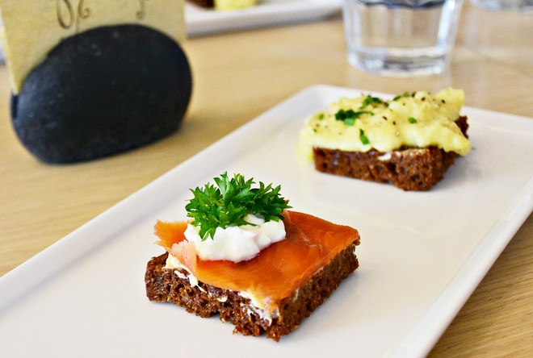
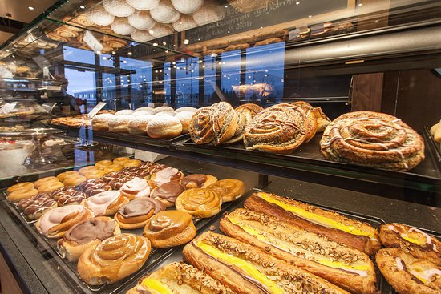
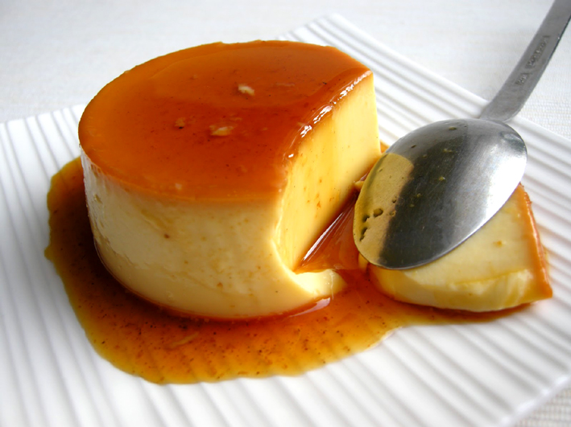

# _Vacation Suggester_

#### _Vacation Suggester Website, {03.05.2018}_

#### By _**Isabella Vanillo**_

## Description

_This webpage demonstrates the use of html, git, bootstrap, javascript, and css._

## Setup/Installation Requirements

* _Clone this repository_
* _Open a simple HTTP server in the top level of the cloned directory. For a mac, run the following command in your terminal:_
* _cd vacation-suggester_
* _atom ._
* _Then open your web browser of choice to index.html_

## Known Bugs

_No known bugs_

## Support and contact details

_If you run into any issues or have questions, ideas or concerns, please contact me at bellavanillo@gmail.com. Or feel free to make a contribution to the code._

## Technologies Used

_html, bootstrap, git, css, javascript_

### License

*This software is licensed under the MIT license.*

Copyright (c) 2016 **_Isabella Vanillo_**

<!DOCTYPE html>
<html>
  <head>
    <link href="css/bootstrap.css" rel="stylesheet" type="text/css">
    <link href="css/styles.css" rel="stylesheet" type="text/css">
    
    
    <title>Vacation Suggester</title>
  </head>
  <body>
    

      <h1>Which Vacation Spot is Right For You?</h1>
      <h3>Take the quiz to find out now!</h3>
      

        <form class="survey">
          <ol>
            

              <li>Which type of weather do you prefer?</li>
              <input type="radio" name="weather" value="hot"> hot 
              <input type="radio" name="weather" value="cold"> cold 
              <input type="radio" name="weather" value="mild"> mild
            

            

              <li>What kind of environment do you want to be in?</li>
              <input type="radio" name="environment" value="bigcity"> big city 
              <input type="radio" name="environment" value="rural"> rural 
              <input type="radio" name="environment" value="beach"> beach
            

            

              <li>Do you want to travel out of the country?</li>
              <input type="radio" name="international" value="yes"> yes 
              <input type="radio" name="international" value="no"> no 
            

            

              <li>Do you want to relax or go on excursions?</li>
              <input type="radio" name="activites" value="excusrions"> excursions 
              <input type="radio" name="activites" value="relax"> relax 
              <input type="radio" name="activites" value="both"> both
            

            

              <li>Pick the ones that looks the best:</li>
              <input type="radio" name="food" value="ice">    
              <input type="radio" name="food" value="rio">    
              <input type="radio" name="food" value="sb">     
            

            <button type="button" class="btn btn-success" name="button">Get my results!</button>
          </form>
        </ol>
      

      

        

          <h2>You should visit Iceland!</h2>
          
Cold weather, northern lights, many outdoor activities, and beautiful sites to see.

          
        

        

          <h2>You should visit Rio De Janeiro!</h2>
          
Big city sites, beautiful beaches, and culture everywhere.

          
        

        

          <h2>You should visit Santa Barbara!</h2>
          
Beaches, mild weather, and relaxing activites.

          
        

      

    

  </body>
</html>
